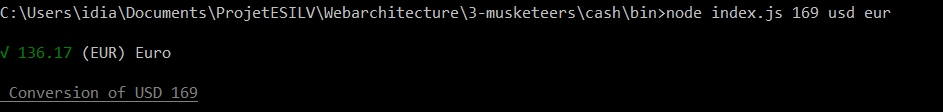

# Cash Readme tutorial - Ibrahim-ba Dia

Introduction
-

Cash can convert currency from your terminal. You just have to enter the currency that you want and the amount of money and you will have the result of your conversion

 
How to Install
-

For the installation I use node.js. In the command prompt I use the following commands

### In the git bash command prompt #

+  cd /path/to/workspace
+ git clone git@github.com:YOUR_USERNAME/3-musketeers.git

### In the node js command prompt #
- cd /path/3-musketeers/cash
- npm install cash
 

How to use it
- 

In your node terminal you have to type the following commands for example if I want my 169$ in Euro (EUR/€) currency 

 
How it works
-

 This library have multiple dependencies to work 

-

+ chalk : A library which stylish the terminal
+ conf : A library which help to config an app or module
+ got : A library which simplify HTTP requests
+ money : A library which help to make some conversion and exchange rate calculation for any currency
+ ora : A library which give some style to the terminal spinner
+ update-notifier : A library which give update notification for the terminal app 

<h2> Files in cash folder</h2>
Currencies.json : Contains the lists of the currencies that the program display

index.js : Take the data from the user which allow to make the process of conversion 

helpers.js : Help and give to the user informations and the different commands of the program 

Outro
-

For more information of the programs lets check the comments in each files enjoy 

